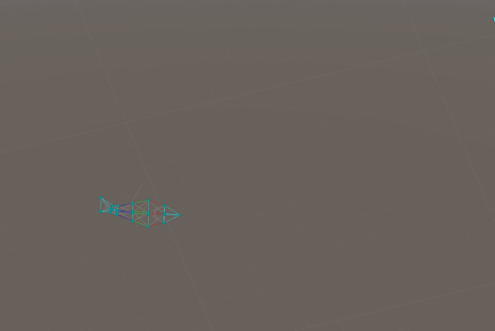
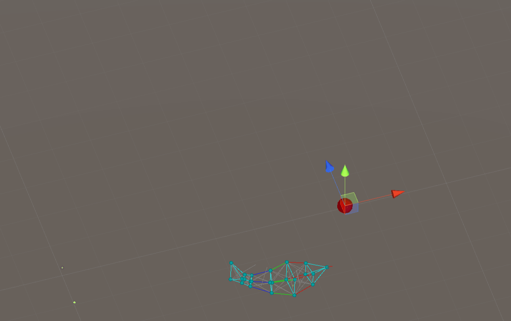
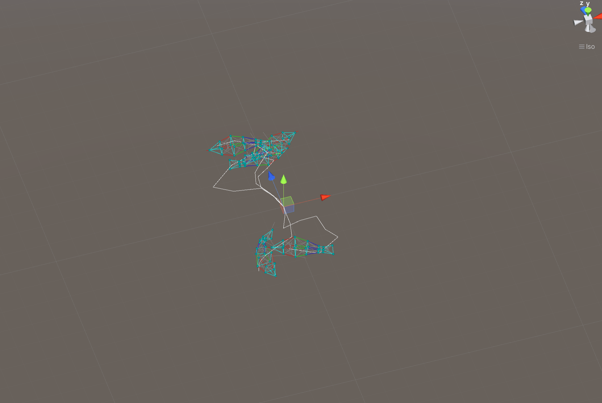

# UnityFishSimulation

This is an implementation of Artificial Fishes: Autonomous Locomotion, Perception, Behavior, and Learning in a Simulated Physical World.

Include

- Fish Structure with mass-spring-damper system
- Optimizer for motion control functions:
  - Downhill Simplex
  - Simulated Annealing
- Fish brain implementation

